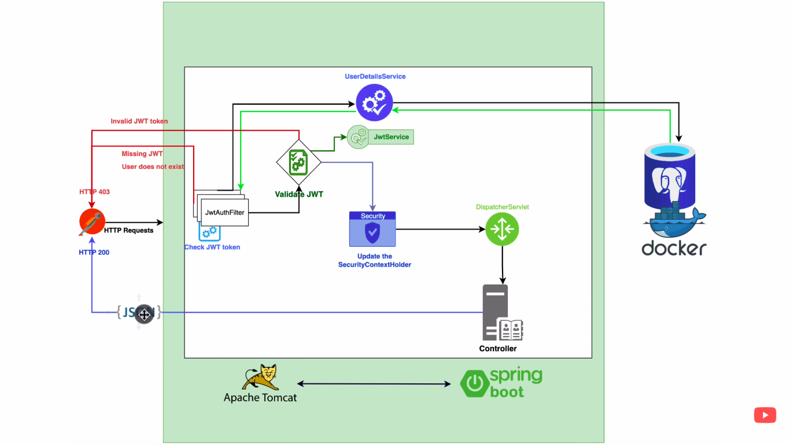

# Spring Security Demo

## Architecture



## Steps
1. Initialize project with following dependencies:
   - Starter Data JPA
   - Starter Web
   - Starter Security
   - MySQL Connector
   - Lombok
2. Create a database for users in mysql.
3. Populate the application.yml file with connection data.
4. Create a User class with following members:
   - id Integer
   - firstname String
   - lastname String
   - email String
   - password String
   - role Enum Role [USER, ADMIN]
5. Add Lombok and JPA annotations to User class
6. Make the User class implement UserDetails interface
7. Override the methods including the getPassword()
8. Configure getAuthorities() override as follows:
   1. Add JPA annotation @Enumerated(EnumType.STRING) above the role field, So that JPA can understand it as ENUM and consider the values instead of the ordinal index (bcoz EnumType.ORDINAL is default).
   2. Return the list of SimpleGrantedAuthoritied by passing the role names,
      ```java
        @Override
        public Collection<? extends GrantedAuthority> getAuthorities() {
          return List.of(new SimpleGrantedAuthority(role.name()));
        }
      ```
9. Create a UserRepository Interface extending JpaRepository Interface
10. Define a method for finding user by email.
11. Create a custom filter for JWT such that it should intercept each and every request:
    1. Create a class named JwtAuthenticationFilter in config folder and extend OncePerRequestFilter class.
    2. Override the doFilter method. Refer the code.
12. Create a service named JwtService in config with @Service annotation. This service will have methods to work with jwt tokens like extracting email,etc.
13. Add 3 dependencies for working with JWT:
    1. jjwt-api
    2. jjwt-impl
    3. jjwt-jackson
14. We will create a method to extract all claims from token using signing key.
15. We will generate a minimum of 256 bits HEX signing key from an online tool [Encryption Key Generator](https://www.allkeysgenerator.com/Random/Security-Encryption-Key-Generator.aspx).
16. 